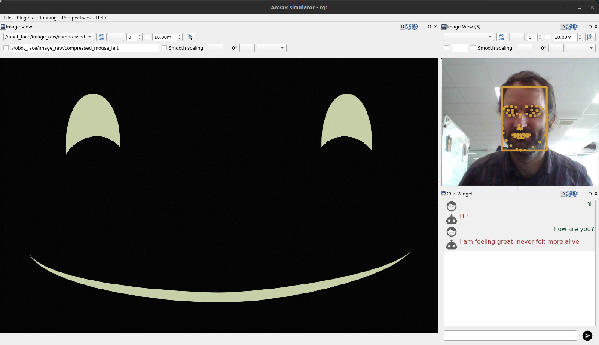
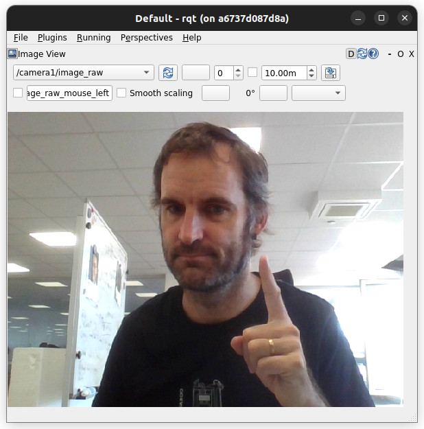
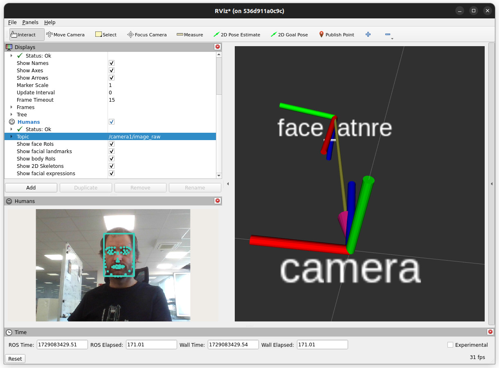
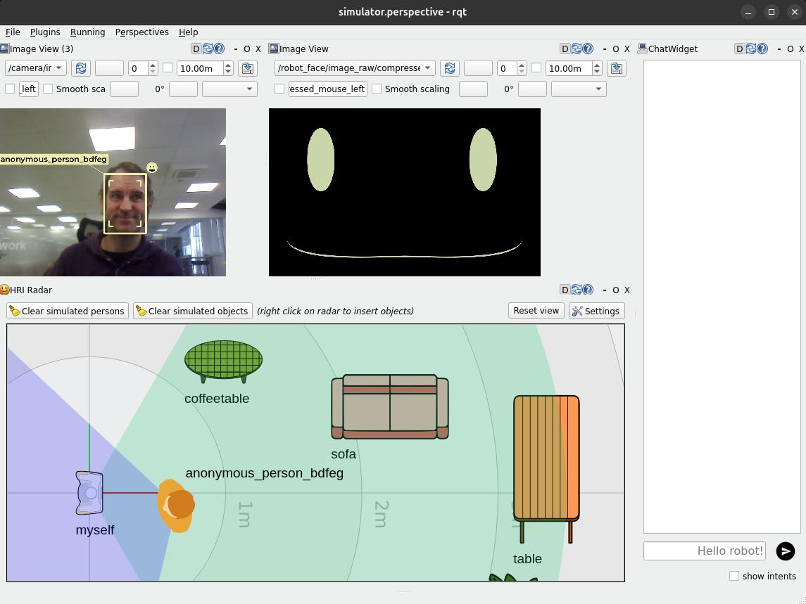
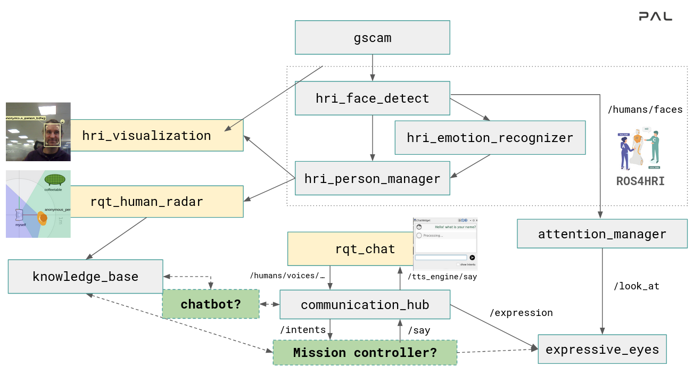
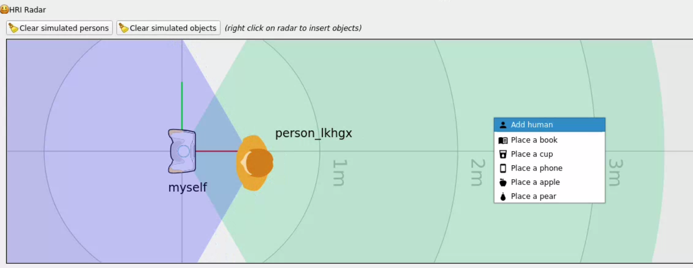
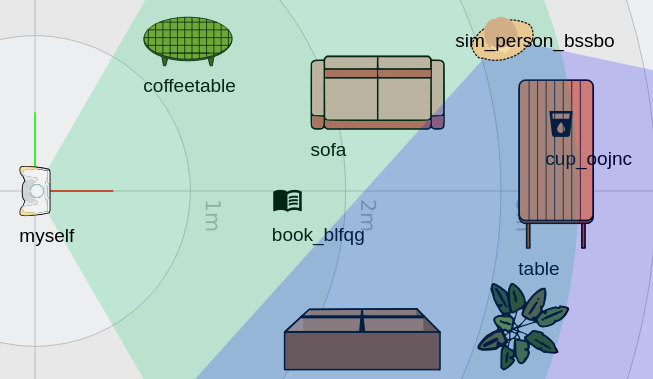
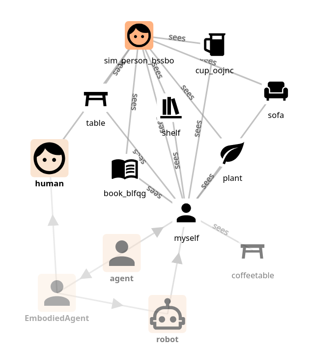
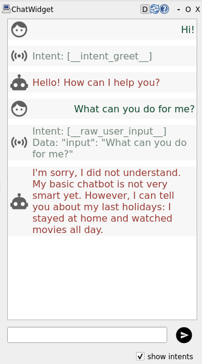

# From Zero to an Interactive Social Robot using ROS4HRI and LLMs

> **‼️ this is a ROS 2 tutorial**
>
> For ROS 1, you can check a similar tutorial
> [here](../intro-ros4hri-devcontainers/)

Welcome!

This tutorial will guide you through the installation and use of the ROS4HRI
framework, a set of ROS nodes and tools to build interactive social robots.

We will use a set of pre-configured Docker containers to simplify the setup
process.

We will also explore how a simple yet complete social robot architecture can be
assembled using ROS 2, PAL Robotics' toolset to quickly generate robot
application templates, and a LLM backend.




**Accompanying slides are available [here](https://docs.google.com/presentation/d/1u8cJRri3J38OIdEW79IoqLq2Tniya7Sg/edit?usp=sharing&ouid=115732286809506967228&rtpof=true&sd=true)**

**Note: the content on this page is not final, and will be updated before the
tutorial day.**

## PART 0: Preparing your environment

### Pre-requisites

To follow 'hands-on' the tutorial, you will need to be able to run a Docker
container on your machine, with access to a X server (to display graphical
applications like `rviz` and `rqt`). We will also use the webcam of your
computer.

Any recent Linux distribution should work, as well as MacOS (with XQuartz
installed).

The tutorial alo assumes that you have a basic understanding of ROS 2 concepts
(topics, nodes, launch files, etc). If you are not familiar with ROS 2, you can
check the [official ROS 2 tutorials](https://docs.ros.org/en/jazzy/Tutorials.html).

### Get the public PAL tutorials Docker image


Fetch the `PAL tutorials` public Docker image:

```
docker pull palrobotics/public-tutorials-alum-devel
```

Then, run the container, with access to your webcam and your X server.

```sh
xhost +
mkdir ros4hri-exchange
docker run -it --name ros4hri \
               --device /dev/video0:/dev/video0 \
               -e DISPLAY=$DISPLAY \
               -v /tmp/.X11-unix:/tmp/.X11-unix \
               -v `pwd`/ros4hri-exchange:/home/user/exchange \
               palrobotics/public-tutorials-alum-devel bash
```

> 💡 The `--device` option is used to pass the webcam to the container, and the
> `-e: DISPLAY` and `-v /tmp/.X11-unix:/tmp/.X11-unix` options are used to display
> graphical applications on your screen.

## PART 1: Warming-up with face detection


### Start the webcam node

First, let's start a webcam node to publish images from the webcam to ROS.

In the terminal, type:

```sh
ros2 run gscam gscam_node --ros-args -p gscam_config:='v4l2src device=/dev/video0 ! video/x-raw,framerate=30/1 ! videoconvert' -p use_sensor_data_qos:=True -p camera_name:=camera -p frame_id:=camera -p camera_info_url:=package://interaction_sim/config/camera_info.yaml
```

> 💡 the `gscam` node is a ROS 2 node that captures images from a webcam and
> publishes them on a ROS topic. The `gscam_config` parameter is used to specify
> the webcam device to use (`/dev/video0`), and the `camera_info_url` parameter
> is used to specify the camera calibration file. We use a default calibration
> file that works reasonably well with most webcams.

You can open `rqt` to check that the images are indeed published:

> 💡 if you want to open another Docker terminal, run
> ```sh
> docker exec -it -u user ros4hri bash
> ```

```bash
rqt
```

Then, in the `Plugins` menu, select `Visualization > Image View`, and choose the topic
`/camera/image_raw`:




### Face detection

[`hri_face_detect`](https://github.com/ros4hri/hri_face_detect) is an
open-source ROS 1/ROS 2 node, compatible with ROS4HRI, that detects faces in images.

It is already installed in the Docker container.

By default, `hri_face_detect` expect images on `/image` topic: before starting the node, we need to configure topic remapping:

```sh
mkdir -p $HOME/.pal/config
nano $HOME/.pal/config/ros4hri-tutorials.yml
```

Then, paste the following content:

```yaml
/hri_face_detect:
   remappings:
      image: /camera/image_raw
      camera_info: /camera/camera_info
```

Press `Ctrl+O` to save, then `Ctrl+X` to exit.

Then, you can launch the node:

```sh
ros2 launch hri_face_detect face_detect.launch.py
```

You should see on your console *which* configuration files are used:

```
$ ros2 launch hri_face_detect face_detect.launch.py 
[INFO] [launch]: All log files can be found below /home/user/.ros/log/2024-10-16-12-39-10-518981-536d911a0c9c-203
[INFO] [launch]: Default logging verbosity is set to INFO
[INFO] [launch.user]: Loaded configuration for <hri_face_detect>:
- System configuration (from lower to higher precedence):
	- /opt/pal/alum/share/hri_face_detect/config/00-defaults.yml
- User overrides (from lower to higher precedence):
	- /home/user/.pal/config/ros4hri-tutorials.yml
[INFO] [launch.user]: Parameters:
- processing_rate: 30
- confidence_threshold: 0.75
- image_scale: 0.5
- face_mesh: True
- filtering_frame: camera_color_optical_frame
- deterministic_ids: False
- debug: False
[INFO] [launch.user]: Remappings:
- image -> /camera/image_raw
- camera_info -> /camera/camera_info
[INFO] [face_detect-1]: process started with pid [214]
...
```

> 💡 this way of managing launch parameters and remapping is not part of base
> ROS 2: it is an extension (available in ROS humble) provided by PAL Robotics
> to simplify the management of ROS 2 nodes configuration.
>
> See for instance the [launch file of `hri_face_detect`](https://github.com/ros4hri/hri_face_detect/blob/humble-devel/launch/face_detect.launch.py#L31)
> to understand how it is used.

You should immediately see on the console that some faces are indeed detected

Let's visualise them:

1. start `rviz2`:

```sh
rviz2
```

2. In `rviz`, visualize the detected faces by adding the `Humans` plugin,
   which you can find in the `hri_rviz` plugins group. The plugin setup
   requires you to specify the image stream you want to use to visualize the
   detection results, in this case `/camera/image_raw`.
   You can also find the plugin as one of those available 
   for the `/camera/image_raw` topic.

> ‼️ **Important**: set the quality of service (QoS) of the `/camera/image_raw`
> topic to `Best Effort`:
>
> 

3. In `rviz`, enable as well the `tf` plugin, and set the fixed frame to `camera`. 
   You should now see a 3D frame, representing the face position and orientation of your face.





> **➡️ to go deeper**
>
> In today's tutorial, we will not go much further with exploring the ROS4HRI tools
> and nodes. However, you can find more information:
> - HRI'23 presentation: [ROS4HRI: A ROS-based Framework for Human-Robot Interaction](https://docs.google.com/presentation/d/1SSq6OmH_qBbjvXN93acqd92QnkmqMuaY/edit?usp=sharing&ouid=115732286809506967228&rtpof=true&sd=true)
> - [PAL Robotics public
>   documentation](https://docs.pal-robotics.com/edge/social-perception/) that
>   includes multiple tutorials and examples
> - on the [ROS4HRI](https://wiki.ros.org/hri) wiki page
> - in the ROS4HRI (ROS 1) tutorial [here](../intro-ros4hri-devcontainers/)
>
> You can also check the [ROS4HRI Github organisation](https://github.com/ros4hri/)
> and the [original paper](https://academia.skadge.org/publis/mohamed2021ros4hri.pdf).


## PART 2: the social interaction simulator

### Starting the interaction simulator

Instead of running nodes manually, we are now going to use PAL *interaction simulator*:




**To start the simulator:**

1. stop all the nodes that are running (like `gscam`, `hri_face_detect`,
   `rqt,` etc)
2. in one of your Docker terminals, launch the simulator:

```
ros2 launch interaction_sim simulator.launch.py
```

**To load a pre-configured scene:**

On the screenshot above, the objets (sofa, table, etc) are defined in an custom
SVG file.

You can load such a pre-configured scene:

1. click on `Settings`, then `Download environment SVG template` and save the
   file in the `exchange` folder (call it for instance `scene.svg`).
2. click on `Load environment` and select the file you just saved.

> 💡 you can open the SVG file in a vector editor like Inkscape to 
> modify the scene (add new objects, change the layout, etc). Check the instructions
> written in the template itself.

### Interaction simulator architecture

The interaction simulator starts several nodes:

The previous two:

1. [`gscam`](https://github.com/ros-drivers/gscam/tree/ros2) to publish images from the webcam
2. [`hri_face_detect`](https://github.com/ros4hri/hri_face_detect) to detect faces in images

And the following new nodes:

3. [`hri_person_manager`](https://github.com/ros4hri/hri_person_manager), to 'combine' faces, bodies, voices into full persons
4. [`hri_emotion_recognizer`](https://github.com/ros4hri/hri_emotion_recognizer), to recognize emotions on the detected faces
5. [`knowledge_core`](https://github.com/severin-lemaignan/knowledge_core), an open-source OWL/RDF-based knowledge base
6. [`hri_visualization`](https://github.com/ros4hri/hri_visualization) to generate a camera image overlay with the faces, bodies, emotions, etc
7. `attention_manager` (not open-source), that decides where to look based on the where the faces are
8. `expressive_eyes` (not open-source), that procedurally generates the robot's face and moves the eyes
9. `communication_hub` (not open-source), that manages the dialogues with the user (user input speech, and robot output speech)

Finally, it launches `rqt` with two custom plugins:

10. [`rqt_human_radar`](https://github.com/ros4hri/rqt_human_radar), to visualize
  the detected people around the robot (and simulated interactions with a
  knowledge base)
11. [`rqt_chat`](https://github.com/pal-robotics/rqt_chat), to chat with the
  robot. When you type a message, it is sent to the ROS4HRI topic
  `/humans/voices/anonymous_speaker/speech`, and the robot's response via the
  `/tts_engine/tts` action are displayed back.


The next figure shows the architecture of the interaction simulator:



### Using the simulator to add symbolic knowledge

When starting the simulator, `knowledge_core` is also started. `knowledge_core`
is a simple OWL/RDF-based knowledge base that can be used to store symbolic
information about the world.

By right-clicking on the top-down view of the environment, you can add new
objects to the knowledge base:



The simulator will then publish the new facts on to the knowledge base,
including whether or not a given object is in the field of view of the robot
and/or humans (eg `myself sees cup_abcd` or `person_lkhgx sees sofa`).

To visualize the knowledge base, we need to start PAL web-based knowledge base viewer.

In a new terminal, start the viewer:

```sh
ros2 launch knowledge_core knowledge_viewer.launch.py
```

Then, open your web browser at `http://localhost:8000` to explore the knowledge base.

For instance, with the following scene:


the knowledge base will contain the following facts:





> 💡 the robot's own 'instance' is always called `myself` in the knowledge base.
>
> For instance `myself sees cup_oojnc` means that the robot sees the cup `cup_oojnc`.

### Accessing the knowledge base from Python

You can easily query the knowledge base from Python:

Start `ipython3` in the terminal:

```sh
ipython3
```

Then, in the Python shell:

```python
from knowledge_core.api import KB
kb = KB()

kb["* sees *"]
```

This will return all the facts in the knowledge base that match the pattern `*
sees *` (ie, all the objects that are seen by someone).

You can also create more complex queries by passing a *list* of semantic
patterns and using *named variables*:

```python
kb[["?h sees ?o", "?o rdf:type dbr:Cup", "?h rdf:type Human"]]
```

This will return all the facts in the knowledge base where a human sees a cup.

> 💡 note the `dbr:` prefix in front of `Cup`: the simulator uses the 'cup'
> concept defined in the DBPedia ontology.


> **➡️ to go deeper**
>
> To learn mode about PAL interaction simulator, check PAL Robotics' [public
> documentation](https://docs.pal-robotics.com/edge/development/interaction-simulator).


## PART 3: Building a simple social behaviour

### Our first mission controller

A mission controller is a ROS node that orchestrates the robot's behaviour.

We will implement our first mission controller as a simple Python script that
copies your facial expression onto the robot's face: an emotion mirroring game.

Since creating a complete ROS 2 node from scratch can be a bit tedious, we will
use the `rpk` tool, a command-line tool created by PAL Robotics, that generates
ROS 2 nodes from templates.


> 💡 `rpk` is already install in the Docker container. You can also install it
> easily on your own machines with `pip install rpk`
>
> As the generator tool itself does not require ROS, you can use it on any
> machine, including eg Windows.

### Step 1: generating the mission controller

- go to your `exchange` folder and create a new workspace:

```sh
cd ~/exchange

# you might have to change the rights of the folder
sudo chown user:user .

mkdir ws
cd ws
```

- run `rpk` to create the mission controller:

```sh
$ rpk create -p src/ mission
ID of your application? (must be a valid ROS identifier without spaces or hyphens. eg 'robot_receptionist')
emotion_mirror
Full name of your skill/application? (eg 'The Receptionist Robot' or 'Database connector', press Return to use the ID. You can change it later)


Choose a template:
1: base robot supervisor [python]
2: robot supervisor with pre-filled intent handlers [python]
3: robot supervisor with a GUI and pre-filled intent handlers [python]
4: complete supervisor example, using a basic chatbot to manage interactions with users [python]
5: complete supervisor example, using LLMs to manage interactions with users [python]

Your choice? 1

What robot are you targeting?
1: Generic robot (generic)
2: Generic PAL robot/simulator (generic-pal)
3: PAL ARI (ari)
4: PAL TIAGo (tiago)
5: PAL TIAGo Pro (tiago-pro)
6: PAL TIAGo Head (tiago-head)

Your choice? (default: 1: generic) 2
```

Choose a `base robot supervisor` template, and the `generic-pal` robot.

The tool will then create a complete ROS 2 mission controller, ready to listen
to incoming user intents (eg, ROS messages pubished on the `/intents` topic).


- build and source the workspace:

```sh
colcon build

source install/setup.bash
```

- start the mission controller:

```sh
ros2 launch emotion_mirror emotion_mirror.launch.py
```

If you now write a line in the `rqt_chat` plugin, you should see the mission
controller reacting to it:

```
[...]
[run_app-1] [INFO] [1729672049.773179100] [emotion_mirror]: Listening to /intents topic
[run_app-1] [INFO] [1729672099.529532393] [emotion_mirror]: Received an intent: __raw_user_input__
[run_app-1] [INFO] [1729672099.529859652] [emotion_mirror]: Processing input: __raw_user_input__
```

> 💡 `rqt_chat` displays 'Processing...' as it waits for a response from the
> mission controller. The mission controller is not doing anything yet, so 
> 'Processing...' is displayed indefinitely (for now!).

The intent `__raw_user_input__` is emitted by the `communication_hub`, and is a
special intent that essentially means: "I don't know what to do with this input,
but I received it".

Since we are not doing anything with the input yet (like trying to figure out
what the user wants be calling a dedicated chatbot), the communication hub
simply sends back the same message with this intent.


### Step 2: add basic interactivity

Modify the template to say something back. To start with, we will always
respond the same thing.

- open `mission_controller.py`:

```sh
cd src/emotion_mirror/emotion_mirror
nano mission_controller.py
```

- in the constructor, create a action client:

```python
#...
from rclpy.action import ActionClient
from tts_msgs.action import TTS
#...

class MissionController(Node):
    def __init__(self):

        #...
        self.tts = ActionClient(self, TTS, '/say')
        self.tts.wait_for_server()

```

- modify the handling on incoming intents to say something back:

```python

    def on_intent(self, msg):
        #...

        if msg.intent == Intent.RAW_USER_INPUT:
            goal = TTS.Goal()
            goal.input = "I'm the famous emotion mirroring robot! (but I'm not great at chatting yet)"
            self.tts.send_goal_async(goal)
```

(up to you to come up with something funny!)

Re-run `colcon build` and relaunch your mission controller to test it with the
chat interface.


Since we are using `communication_hub` as a middle-man, we can also use markup
in our sentences to change the expression of the robot.

For example, you can use the following markup to display an happy face:

```
"<set expression(happy)> I'm the famous emotion mirroring robot! My holiday was great <set expression(amazed)>, thank you for asking! <set expression(neutral)>"
```

> **➡️ to go deeper**
>
> You can check the online documentation of the [markup language](https://docs.pal-robotics.com/edge/communication/tts_howto#multi-modal-expression-markup-language)
> used by the `communication_hub` to get the list of available actions and expressions.
> 
> Note that `communication_hub`, while available in binary form in the Docker image, is 
> not open-source. Alternatively, you can also simply manually set the robot's expression 
> by publishing on the `/robot_face/expression` topic (as we do below).


### Step 3: emotion mimicking game

We can now extend our mission controller to implement our emotion mirroring
game.

To get the recognised facial expression of the current user, we can use the
ROS4HRI tools:

For instance:

```python
from hri import HRIListener

hri_listener = HRIListener("mimic_emotion_hrilistener")

for face_id, face in hri_listener.faces.items():
    if face.expression:
            print(f"Face {face_id} shows expression {face.expression}")
```

Then, we can set the same expression onto the robot face:

```python
from hri_msgs.msg import Expression

expression_pub = self.create_publisher(Expression, "/robot_face/expression", QoSProfile(depth=10))

msg = Expression()
msg.expression = "happy" # see Expression.msg for all available expressions
expression_pub.publish(msg)
```

Modify the mission controller to add a background 'job' of checking for people's
face, and accordingly set the robot's expression:

Add a `run()` method at the bottom of your mission controller:

```python
def run(self) -> None:

    self.get_logger().info("Checking expressions...")

    for face_id, face in self.hri_listener.faces.items():
        if face.expression:
                print(f"Face {face_id} shows expression {face.expression}")
                
                msg = Expression()
                msg.expression = face.expression
                self.expression_pub.publish(msg)
```

Then, in the `__init__` constructor, create the HRI listener, the expression
publisher, and a timer to regularly call the `run()` method:

```python

def __init__(self):


    # ...

    self.hri_listener = HRIListener("mimic_emotion_hrilistener")
    self.expression_pub = self.create_publisher(Expression, "/robot_face/expression", QoSProfile(depth=10))

    self._timer = self.create_timer(0.1, self.run) # check at 10Hz
``` 

The final complete script should look like:

```python
import json

from rclpy.node import Node
from rclpy.qos import QoSProfile
from rclpy.action import ActionClient

from hri_actions_msgs.msg import Intent
from hri_msgs.msg import Expression
from tts_msgs.action import TTS
from hri import HRIListener

class MissionController(Node):

    def __init__(self) -> None:
        super().__init__('app_emotion_mirror')

        self.get_logger().info("Initialising...")

        self._intents_sub = self.create_subscription(
            Intent,
            '/intents',
            self.on_intent,
            10)
        self.get_logger().info("Listening to %s topic" %
                               self._intents_sub.topic_name)

        self.hri_listener = HRIListener("mimic_emotion_hrilistener")
        self.expression_pub = self.create_publisher(Expression, "/robot_face/expression", QoSProfile(depth=10))
        self.last_expression = ""

        self.tts = ActionClient(self, TTS, '/say')
        self.tts.wait_for_server()

        self._timer = self.create_timer(0.1, self.run) # check at 10Hz

    def __del__(self):
        self.get_logger().info("Destroying Mission Controller")
        self.destroy_subscription(self._intents_sub)

    def on_intent(self, msg) -> None:

        self.get_logger().info("Received an intent: %s" % msg.intent)

        data = json.loads(msg.data) if msg.data else {}  # noqa: F841
        source = msg.source  # noqa: F841
        modality = msg.modality  # noqa: F841
        confidence = msg.confidence  # noqa: F841
        priority_hint = msg.priority  # noqa: F841

        if msg.intent == Intent.RAW_USER_INPUT:
            self.get_logger().info(f"Processing input: {msg.intent} -> {data}")
            goal = TTS.Goal()
            goal.input = "I'm the famous emotion mirroring robot!"
            self.tts.send_goal_async(goal)
        else:
            self.get_logger().warning("I don't know how to process intent "
                                      "<%s>!" % msg.intent)
    def run(self) -> None:

        faces = list(self.hri_listener.faces.items())
        if faces:
            # only consider the first detected face
            face_id, face = faces[0]
            if face.expression and face.expression != self.last_expression:
                    expression = face.expression.name.lower()
                    print(f"Face {face_id} shows expression {expression}")

                    goal = TTS.Goal()
                    goal.input = f"you look {expression}. Same for me!"
                    self.tts.send_goal_async(goal)

                    msg = Expression()
                    msg.expression = expression
                    self.expression_pub.publish(msg)

                    self.last_expression = face.expression
```

## CHAPTER 3: Integration with LLMs


### Step 1: creating a chatbot


1. use `rpk` to create a new `chatbot` skill using the *basic chabot* intent
   extraction template:

```sh
$ rpk create -p src intent
ID of your application? (must be a valid ROS identifier without spaces or hyphens. eg 'robot_receptionist')
chatbot
Full name of your skill/application? (eg 'The Receptionist Robot' or 'Database connector', press Return to use the ID. You can change it later)


Choose a template:
1: basic chatbot template [python]
2: complete intent extraction example: LLM bridge using the OpenAI API (ollama, chatgpt) [python]

Your choice? 1

What robot are you targeting?
1: Generic robot (generic)
2: Generic PAL robot/simulator (generic-pal)
3: PAL ARI (ari)
4: PAL TIAGo (tiago)
5: PAL TIAGo Pro (tiago-pro)
6: PAL TIAGo Head (tiago-head)

Your choice? (default: 1: generic) 2
```

Compile and run the chatbot:

```sh
colcon build
source install/setup.bash
ros2 launch chatbot chatbot.launch.py
```

If you know type a message in the `rqt_chat` plugin, you should see the chatbot
responding to it:



You can also see in the chat window the *intents* that the chatbot has
identified in the user input. For now, our basic chatbot only recognises the
`__intent_greet__` intent when you type `Hi` or `Hello`.


### Step 2: integrating the chatbot with the mission controller


To fully understand the intent pipeline, we will modify the chatbot to
recognise a 'pick up' intent, and the mission controller to handle it.

- modify your chatbot to check whether incoming speech matches `[please] pick up [the] <object>`:

```python
import re

def contains_pickup(sentence):
    sentence = sentence.lower()

    # matches sentences like: [please] pick up [the] <object> and return <object>
    pattern = r"(?:please\s+)?pick\s+up\s+(?:the\s+)?(\w+)"
    match = re.search(pattern, sentence)
    if match:
        return match.group(1)
```

- then, in the `on_get_response` function, check if the incoming speech matches the pattern, and if so, return a `__intent_grab_object__`:

```python
def on_get_response(self, request, response):

    #...

    pick_up_object = self.contains_pickup(input)
    if pick_up_object:
        self.get_logger().warn(f"I think the user want to pick up a {pick_up_object}. Sending a GRAB_OBJECT intent")
        intent = Intent(intent=Intent.GRAB_OBJECT,
                        data=json.dumps({"object": pick_up_object}),
                        source=user_id,
                        modality=Intent.MODALITY_SPEECH,
                        confidence=.8)
        suggested_response = f"Sure, let me pick up this {pick_up_object}"
    # elif ...
```

> 💡 the `Intent` message is defined in the `hri_actions_msgs` package, and
> contains the intent, the data associated with the intent, the source of the
> intent (here, the current `user_id`), the modality (here, `speech`), and the confidence of the
> recognition.
>
> Check the [Intents documentation on PAL
> website](https://docs.pal-robotics.com/edge/development/intents) for details,
> or directly the
> [Intent.msg](https://github.com/ros4hri/hri_actions_msgs/blob/humble-devel/msg/Intent.msg)
> definition.

Test your updated chatbot by recompiling the workspace (`colcon build`) and relaunching the chatbot.

If you now type `pick up the cup` in the chat window, you should see the chatbot
recognising the intent and sending a `GRAB_OBJECT` intent to the mission controller.

- finally, modify the mission controller function handling inbound intents,
   in order to manage the `GREET` intent:

   ```python
    def on_intent(self, msg):
        #...

        if msg.intent == Intent.RAW_USER_INPUT:
            goal = TTS.Goal()
            goal.input = "<set expression(happy)> Hey there!"
            self.tts.send_goal_async(goal)
    ```

4. similarly, send back an appropriate `__start_activity__` intent if the user
   ask to 'copy expressions'. To do so, define a similar function


### Integrating with a Large Language Model

Next, let's integrate with an LLM.

#### Step 1: using `ollama`

`ollama` is an open-source tool that provides a simple REST API to interact with
a variety of LLMs. It makes it easy to install different LLMs, and to call them
using the same REST API as, eg, OpenAI's ChatGPT.

To install `ollama` on your machine, follow the instructions on the
[official repository](https://ollama.com/download):

```sh
curl -fsSL https://ollama.com/install.sh | sh
```

Once it is installed, you can start the `ollama` server with:

```sh
ollama serve
```

Open a new Docker terminal, and run the following command to download a first model and check it works:

```sh
ollama run deepseek-r1:1.5b
```

> 💡 Visit the [`ollama` model page ](https://ollama.com/search) to see the
> list of available models.
>
> Depending on the size of the model and your computer configuration, the
> response time can be quite long.
>
> If you have a NVIDIA GPU, you might want to relaunch your Docker container
> with GPU support. Check the [instructions on the NVidia
> website](https://docs.nvidia.com/datacenter/cloud-native/container-toolkit/latest/install-guide.html).
>
> Alternatively, you can run `ollama` on your host machine, as we will interact
> with it via a REST API.


1. Install `ollama` on your machine, download a LLM model (for instance, the small
   `deepseek-r1:1b`) with `ollama run deepseek-r1:1b`, and start `ollama serve`.

2. install the `ollama` python binding inside your Docker image: `pip install
   ollama`.


2. Modify your chatbot to connect to `ollama`, send the user input, and return
   a `__intent_say__` with the text returned by the LLM. You might need to
   extend your mission controller to handle the `__intent_say__`.
3. Write a better prompt for your robot, and submit it to `ollama`, alongside
   the user input.

Calling the LLM via `ollama` is as simple as:

```python
import ollama

PROMPT="you are a helpful robot"

response = ollama.chat(model='llama3.2:1b', messages=[
  {
    'role': 'system',
    'content': PROMPT,
  },
  {
    'role': 'user',
    'content': 'Why is the sky blue?',
  },
])
print(response['message']['content'])
```

