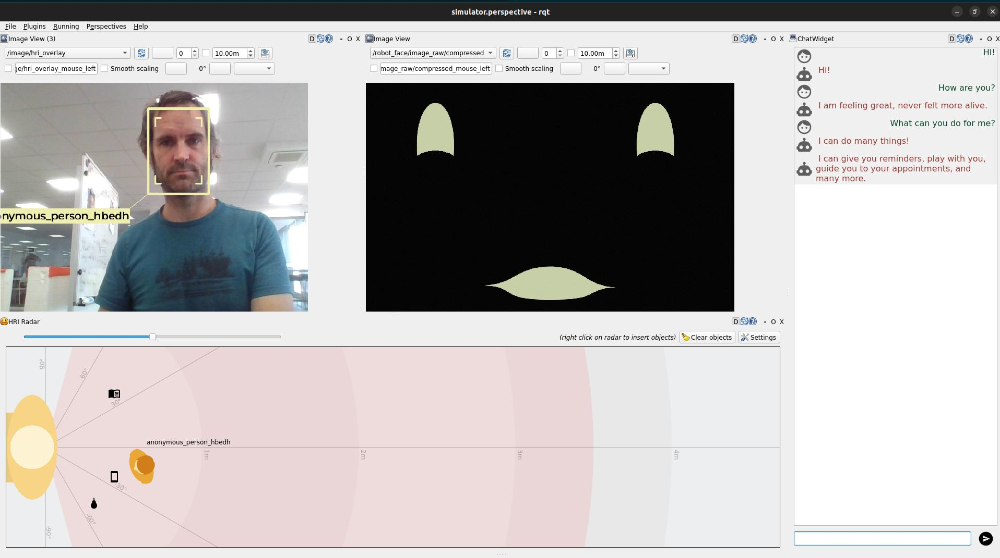

# From Zero to an Interactive Social Robot using ROS4HRI and LLMs

> **‼️ this is a ROS 2 tutorial**
>
> For ROS 1, you can check a similar tutorial
> [here](../intro-ros4hri-devcontainers/)

Welcome!

This tutorial will guide you through the installation and use of the ROS4HRI
framework, a set of ROS nodes and tools to build interactive social robots.

We will use a set of pre-configured Docker containers to simplify the setup
process.

We will also explore how a simply yet complete social robot architecture can be
assembled using ROS 2, PAL Robotics' toolset to quickly generate robot
application templates, and a LLM backend.




**Note: the content on this page is not final, and will be updated before the
tutorial day.**

## Pre-requisites

To follow 'hands-on' the tutorial, you will need to be able to run a Docker
container on your machine, with access to a X server (to display graphical
applications like `rviz` and `rqt`). We will also use the webcam of your
computer.

Any recent Linux distribution should work, as well as MacOS (with XQuartz
installed).


## Preparing your environment

Fetch the `PAL tutorials` public Docker image:

```
docker pull palrobotics/public-tutorials-alum-devel
```

Then, run the container, with access to your webcam and your X server.

```sh
docker run -it --name ros4hri \
               --device /dev/video0:/dev/video0 \
               -e DISPLAY=$DISPLAY \
               -v /tmp/.X11-unix:/tmp/.X11-unix \
               palrobotics/public-tutorials-alum-devel bash
```

> 💡 The `--device` option is used to pass the webcam to the container, and the
> `-e: DISPLAY` and `-v /tmp/.X11-unix:/tmp/.X11-unix` options are used to display
> graphical applications on your screen.


### Share files between host and docker container

For convenience, you can also mount a folder on your host machine to the
container, to share files between the two environments:

```sh
mkdir ros4hri-exchange
docker run -it --name ros4hri \
               --device /dev/video0:/dev/video0 \
               -e DISPLAY=$DISPLAY \
               -v /tmp/.X11-unix:/tmp/.X11-unix \
               -v `pwd`/ros4hri-exchange:/home/user/exchange \
               palrobotics/public-tutorials-alum-devel bash
```

## Face detection


### Start the webcam node

First, let's start a webcam node to publish images from the webcam to ROS.

In the terminal, type:

```sh
ros2 launch usb_cam camera.launch.py
```

You can open `rqt` to check that the images are indeed published:

> 💡 if you want to open another Docker terminal, run
> ```sh
> docker exec -it -u user ros4hri bash
> ```

```bash
rqt
```

Then, in the `Plugins` menu, select `Image View`, and choose the topic
`/came1/image_raw`:


### Start the face detection node

[`hri_face_detect`](https://github.com/ros4hri/hri_face_detect) is an
open-source ROS 1/ROS 2 node, compatible with ROS4HRI, that detects faces in images.

It is already installed in the Docker container.

By default, `hri_face_detect` expect images on `/image` topic: before starting the node, we need to configure topic remapping:

```sh
mkdir -p $HOME/.pal/config
nano $HOME/.pal/config/ros4hri-tutorials.yml
```

Then, paste the following content:

```yaml
/hri_face_detect:
   remappings:
      image: /camera1/image_raw
      camera_info: /camera1/camera_info
```

Then, you can launch the node:

```sh
ros2 launch hri_face_detect face_detect.launch.py
```

You should see on your console *which* configuration files are used:

```
$ ros2 launch hri_face_detect face_detect.launch.py 
[INFO] [launch]: All log files can be found below /home/user/.ros/log/2024-10-16-12-39-10-518981-536d911a0c9c-203
[INFO] [launch]: Default logging verbosity is set to INFO
[INFO] [launch.user]: Loaded configuration for <hri_face_detect>:
- System configuration (from lower to higher precedence):
	- /opt/pal/alum/share/hri_face_detect/config/00-defaults.yml
- User overrides (from lower to higher precedence):
	- /home/user/.pal/config/ros4hri-tutorials.yml
[INFO] [launch.user]: Parameters:
- processing_rate: 30
- confidence_threshold: 0.75
- image_scale: 0.5
- face_mesh: True
- filtering_frame: camera_color_optical_frame
- deterministic_ids: False
- debug: False
[INFO] [launch.user]: Remappings:
- image -> /camera1/image_raw
- camera_info -> /camera1/camera_info
[INFO] [face_detect-1]: process started with pid [214]
...
```

> 💡 this way of managing launch parameters and remapping is not part of base
> ROS 2: it is an extension (available in ROS humble) provided by PAL Robotics
> to simplify the management of ROS 2 nodes configuration.
>
> See for instance the [launch file of `hri_face_detect`](https://github.com/ros4hri/hri_face_detect/blob/humble-devel/launch/face_detect.launch.py#L31)
> to understand how it is used.

You should immediately see on the console that some faces are indeed detected
(if not, try restart the `usb_cam` node: ROS 2 sometimes struggles with large
messages like images).

Let's visualise them:

1. start the `hri_visualization` node:

First, configure the remapping:

```sh
nano $HOME/.pal/config/ros4hri-tutorials.yml
```

Then, add the following content at the bottom:

```yaml
/hri_visualization:
   remappings:
      image: /camera1/image_raw
```

Then:

```sh
ros2 launch hri_visualization hri_visualization.launch.py
```

2. in `rqt`, change the topic of the `Image View` plugin to
   `/camera1/image_raw/hri_overlay`. You should now see your face, overlaid with
   facial key points.

**TODO**: add a screenshot here

3. open a new Docker terminal, and launch `rviz`:

```sh
rviz2
```

Enable the `tf` plugin, and set the fixed frame to `camera`. You should now see
a 3D frame, representing the face position and orientation of your face.


> 💡 on the above screenshot, the `Humans` plugin has also been added: once
> configured with the _raw_ image topic `/camera1/imnage_raw`, it should
> display an image similar to the one in `rqt`.

> **➡️ to go further**
>
> In today's tutorial, we will not go further with exploring the ROS4HRI tools
> and nodes. However, you can find more information:
> - on the [ROS4HRI](https://wiki.ros.org/hri) wiki page
> - in the ROS4HRI (ROS 1) tutorial [here](../intro-ros4hri-devcontainers/)
>
> You can also check the [ROS4HRI Github organisation](https://github.com/ros4hri/)
> and the [original paper](https://academia.skadge.org/publis/mohamed2021ros4hri.pdf).

## Building a social robot architecture


## The app supervisors and ROS Intents

## Integration with LLMs


## If you want more...!

Here a few additional tasks you might want to try, to further explore ROS4HRI:

- Write a small Python script that list on the console the people around the
  robot ([hint!](https://www.phind.com/search?cache=rhu3n4zmjwshfp0h3vp29b9w)).

- write a node (C++ or Python) to automatically match faces and bodies. One
  approach consists in computing the overlap of the regions of interest of pairs
  of (face, body), and compute a likelihood based on that.

  Check the [C++ `libhri` API
  documentation](http://docs.ros.org/en/humble/p/hri/) here.
