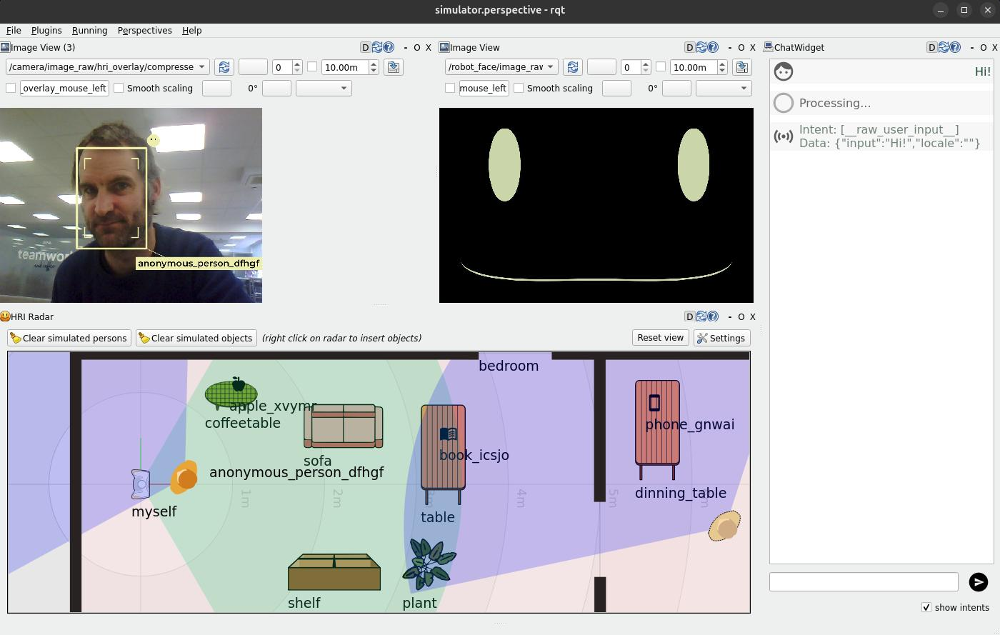

# From Zero to an Interactive Social Robot using ROS4HRI and LLMs

> **‼️ this is a ROS 2 tutorial**
>
> For ROS 1, you can check a similar tutorial
> [here](../intro-ros4hri-devcontainers/)

Welcome!

This tutorial will guide you through the installation and use of the ROS4HRI
framework, a set of ROS nodes and tools to build interactive social robots.

We will use a set of pre-configured Docker containers to simplify the setup
process.

We will also explore how a simple yet complete social robot architecture can be
assembled using ROS 2, PAL Robotics' toolset to quickly generate robot
application templates, and a LLM backend.


**Accompanying slides are available [here](https://docs.google.com/presentation/d/1u8cJRri3J38OIdEW79IoqLq2Tniya7Sg/edit?usp=sharing&ouid=115732286809506967228&rtpof=true&sd=true)**

**Note: the content on this page is not final, and will be updated before the
tutorial day.**

## CHAPTER 0: Preparing your environment

### Pre-requisites

To follow 'hands-on' the tutorial, you will need to be able to run a Docker
container on your machine, with access to a X server (to display graphical
applications like `rviz` and `rqt`). We will also use the webcam of your
computer.

Any recent Linux distribution should work, as well as MacOS (with XQuartz
installed).

The tutorial alo assumes that you have a basic understanding of ROS 2 concepts
(topics, nodes, launch files, etc). If you are not familiar with ROS 2, you can
check the [official ROS 2 tutorials](https://docs.ros.org/en/jazzy/Tutorials.html).

### Get the public PAL tutorials Docker image


Fetch the `PAL tutorials` public Docker image:

```
docker pull palrobotics/public-tutorials-alum-devel
```

Then, run the container, with access to your webcam and your X server.

```sh
xhost +
mkdir ros4hri-exchange
docker run -it --name ros4hri \
               --device /dev/video0:/dev/video0 \
               -e DISPLAY=$DISPLAY \
               -v /tmp/.X11-unix:/tmp/.X11-unix \
               -v `pwd`/ros4hri-exchange:/home/user/exchange \
               palrobotics/public-tutorials-alum-devel bash
```

> 💡 The `--device` option is used to pass the webcam to the container, and the
> `-e: DISPLAY` and `-v /tmp/.X11-unix:/tmp/.X11-unix` options are used to display
> graphical applications on your screen.

## CHAPTER 1: Face detection


### Start the webcam node

First, let's start a webcam node to publish images from the webcam to ROS.

In the terminal, type:

```sh
ros2 launch usb_cam camera.launch.py
```

You can open `rqt` to check that the images are indeed published:

> 💡 if you want to open another Docker terminal, run
> ```sh
> docker exec -it -u user ros4hri bash
> ```

```bash
rqt
```

Then, in the `Plugins` menu, select `Visualization > Image View`, and choose the topic
`/camera1/image_raw`:


> 💡 the camera image might freeze after a while: it is a known issue with
> `usb_cam` (due to their configuration of ROS 2 Quality of
> Service parameters).
>
> Simple restart the `usb_cam` node to fix the issue (Ctrl+C to stop the node).

### Face detection

[`hri_face_detect`](https://github.com/ros4hri/hri_face_detect) is an
open-source ROS 1/ROS 2 node, compatible with ROS4HRI, that detects faces in images.

It is already installed in the Docker container.

By default, `hri_face_detect` expect images on `/image` topic: before starting the node, we need to configure topic remapping:

```sh
mkdir -p $HOME/.pal/config
nano $HOME/.pal/config/ros4hri-tutorials.yml
```

Then, paste the following content:

```yaml
/hri_face_detect:
   remappings:
      image: /camera1/image_raw
      camera_info: /camera1/camera_info
```

Then, you can launch the node:

```sh
ros2 launch hri_face_detect face_detect.launch.py
```

You should see on your console *which* configuration files are used:

```
$ ros2 launch hri_face_detect face_detect.launch.py 
[INFO] [launch]: All log files can be found below /home/user/.ros/log/2024-10-16-12-39-10-518981-536d911a0c9c-203
[INFO] [launch]: Default logging verbosity is set to INFO
[INFO] [launch.user]: Loaded configuration for <hri_face_detect>:
- System configuration (from lower to higher precedence):
	- /opt/pal/alum/share/hri_face_detect/config/00-defaults.yml
- User overrides (from lower to higher precedence):
	- /home/user/.pal/config/ros4hri-tutorials.yml
[INFO] [launch.user]: Parameters:
- processing_rate: 30
- confidence_threshold: 0.75
- image_scale: 0.5
- face_mesh: True
- filtering_frame: camera_color_optical_frame
- deterministic_ids: False
- debug: False
[INFO] [launch.user]: Remappings:
- image -> /camera1/image_raw
- camera_info -> /camera1/camera_info
[INFO] [face_detect-1]: process started with pid [214]
...
```

> 💡 this way of managing launch parameters and remapping is not part of base
> ROS 2: it is an extension (available in ROS humble) provided by PAL Robotics
> to simplify the management of ROS 2 nodes configuration.
>
> See for instance the [launch file of `hri_face_detect`](https://github.com/ros4hri/hri_face_detect/blob/humble-devel/launch/face_detect.launch.py#L31)
> to understand how it is used.

You should immediately see on the console that some faces are indeed detected
(if not, try restart the `usb_cam` node: ROS 2 sometimes struggles with large
messages like images).

Let's visualise them:

1. start `rviz2`:

```sh
rviz2
```

2. In `rviz`, visualize the detected faces by adding the `Humans` plugin,
   which you can find in the `hri_rviz` plugins group. The plugin setup
   requires you to specify the image stream you want to use to visualize the
   detection results, in this case `/camera1/image_raw`.
   You can also find the plugin as one of those available 
   for the `/camera1/image_raw` topic.

3. In `rviz`, add as well the `tf` plugin, and set the fixed frame to `camera`. 
   You should now see a 3D frame, representing the face position and orientation of your face.


## CHAPTER 2: Building a social robot architecture

### Using the interaction simulator

Instead of running nodes manually, we are now going to use our so-called *interaction simulator*:




**To start the simulator:**

1. stop all the nodes that are running (like `usb_cam`, `hri_face_detect`,
   `rqt,` etc)
2. in one of the Docker terminal, launch the simulator:

```
ros2 launch interaction_sim simulation.launch.py
```

The interaction simulator starts the following nodes:

The previous two:
- `usb_cam` to publish images from the webcam
- [`hri_face_detect`](https://github.com/ros4hri/hri_face_detect) to detect faces in images

And the following new nodes:
- [`hri_person_manager`](https://github.com/ros4hri/hri_visualization), to 'combine' faces, bodies, voices into full persons
- [`hri_emotion_recognizer`](https://github.com/ros4hri/hri_emotion_recognizer), to recognize emotions on the detected faces
- `attention_manager`, that decides where to look based on the where the faces are
- `expressive_eyes`, that procedurally generates the robot's face and moves the eyes
- `communication_hub`, that manages the dialogues with the user (user input speech, and robot output speech)
- [`knowledge_core`](https://github.com/severin-lemaignan/knowledge_core), an open-source OWL/RDF-based knowledge base
- [`hri_visualization`](https://github.com/ros4hri/hri_visualization) to generate a camera image overlay with the faces, bodies, emotions, etc

Finally, it launches `rqt` with two custom plugins:

- [`rqt_human_radar`](https://github.com/ros4hri/rqt_human_radar), to visualize
  the detected people around the robot (and simulated interactions with a
  knowledge base)
- [`rqt_chat`](https://github.com/pal-robotics/rqt_chat), to chat with the
  robot. When you type a message, it is sent to the ROS4HRI topic
  `/humans/voices/anonymous_speaker/speech`, and the robot's response via the
  `/tts_engine/tts` action are displayed back.


> **➡️ to go further**
>
> In today's tutorial, we will not go much further with exploring the ROS4HRI tools
> and nodes. However, you can find more information:
> - HRI'23 presentation: [ROS4HRI: A ROS-based Framework for Human-Robot Interaction](https://docs.google.com/presentation/d/1SSq6OmH_qBbjvXN93acqd92QnkmqMuaY/edit?usp=sharing&ouid=115732286809506967228&rtpof=true&sd=true)
> - on the [ROS4HRI](https://wiki.ros.org/hri) wiki page
> - in the ROS4HRI (ROS 1) tutorial [here](../intro-ros4hri-devcontainers/)
>
> You can also check the [ROS4HRI Github organisation](https://github.com/ros4hri/)
> and the [original paper](https://academia.skadge.org/publis/mohamed2021ros4hri.pdf).


### Our first mission controller

**TODO**

> Run `rpk` to create the mission controller `rpk create mission --id emotion_mirror`
> Use `colcon` to start it
> run it

#### Step 1

See the input intent on the console

#### Step 2

Modify the template to say something back that is random about robot's holiday

#### Step 3

Use markup to set the expression of the robot and use ROS4HRI
detect the user's emotion and use that to play the emotion mimicking
game.

### Adding a task

`rpk create task --id greet_task`

**TODO**

> The robot saying something very simple (greeeting)
> and changing the eyes shape.
> In mission controller we should add a regex check
> to see if the text received contains a greeting from the user.

## CHAPTER 3: Integration with LLMs


## If you want more...!

Here a few additional tasks you might want to try, to further explore ROS4HRI:

- Write a small Python script that list on the console the people around the
  robot ([hint!](https://www.phind.com/search?cache=rhu3n4zmjwshfp0h3vp29b9w)).

- write a node (C++ or Python) to automatically match faces and bodies. One
  approach consists in computing the overlap of the regions of interest of pairs
  of (face, body), and compute a likelihood based on that.

  Check the [C++ `libhri` API
  documentation](http://docs.ros.org/en/humble/p/hri/) here.
